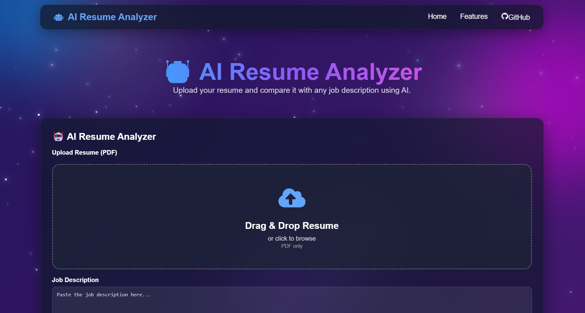
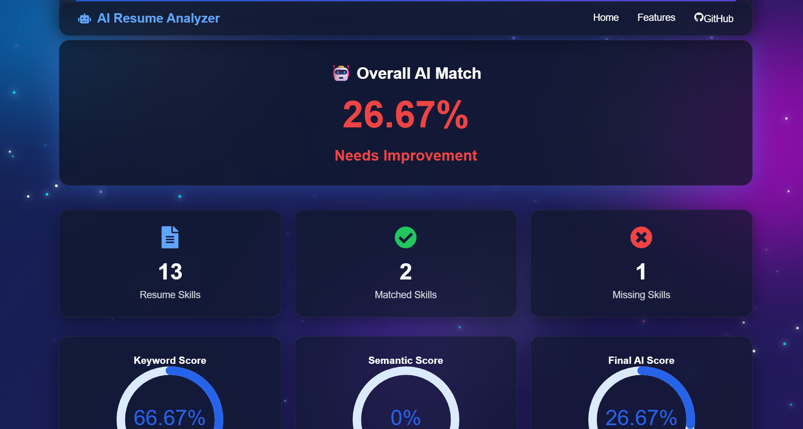
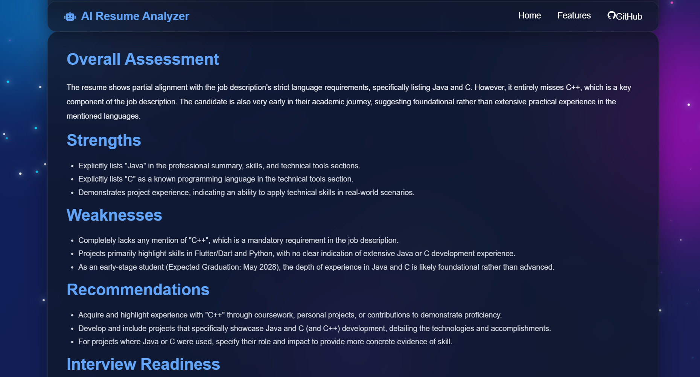

# 🤖 AI Resume Analyzer

An AI-powered Resume Analyzer that compares a candidate's resume with a job description and provides an ATS score, skill matching, AI-generated feedback, and personalized improvement suggestions.

## 🚀 Live Demo

**Frontend:** https://ai-resume-analyzer-1-wfu9.onrender.com

**Backend:** https://ai-resume-analyzer-gmhw.onrender.com

---

## 📌 Features

* 📄 Upload PDF resumes
* 🎯 ATS keyword matching
* 🧠 AI-generated resume review using Google Gemini
* 💼 Resume skill extraction
* ✅ Matched skills identification
* ❌ Missing skills detection
* 📊 AI Resume Score
* 💡 Personalized resume improvement suggestions
* 📥 Download resume analysis report
* 🌐 Fully deployed web application

---

## 🛠️ Tech Stack

### Frontend

* React.js
* Axios
* CSS3
* React Toastify

### Backend

* FastAPI
* Python
* pdfplumber
* Google Gemini API

### Deployment

* Render (Frontend)
* Render (Backend)

---

## 📂 Project Structure

```
AI-Resume-Analyzer/
│
├── frontend/
│   ├── src/
│   ├── public/
│   └── package.json
│
├── backend/
│   ├── app/
│   │   ├── routers/
│   │   ├── services/
│   │   ├── main.py
│   │   └── requirements.txt
│   └── uploads/
│
└── README.md
```

---

## ⚙️ Installation

### Clone the Repository

```bash
git clone https://github.com/YOUR_USERNAME/AI-Resume-Analyzer.git

cd AI-Resume-Analyzer
```

---

### Backend Setup

```bash
cd backend

python -m venv venv

# Windows
venv\Scripts\activate

pip install -r requirements.txt

uvicorn app.main:app --reload
```

Backend runs on:

```
http://127.0.0.1:8000
```

---

### Frontend Setup

```bash
cd frontend

npm install

npm run dev
```

Frontend runs on:

```
http://localhost:5173
```

---

## 📊 How It Works

1. Upload a PDF resume.
2. Enter a job description.
3. Resume text is extracted from the PDF.
4. Skills are identified from the resume.
5. ATS keyword matching compares the resume with the job description.
6. Google Gemini generates detailed resume feedback.
7. The application displays:

   * ATS Score
   * Resume Skills
   * Matched Skills
   * Missing Skills
   * Improvement Suggestions
   * AI Review

---

## 📷 Screenshots


### Home Page



### Resume Analysis



### AI Review



---

## 🔮 Future Improvements

* Semantic similarity scoring using Gemini embeddings
* Resume ranking against multiple job descriptions
* Authentication and user accounts
* Resume history dashboard
* Dark mode
* Multi-language resume support

---

## 👩‍💻 Author

**Tannu Priya**

If you found this project useful, consider giving it a ⭐ on GitHub.
